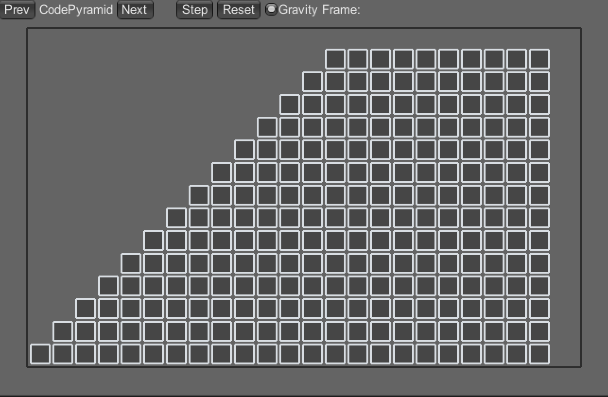
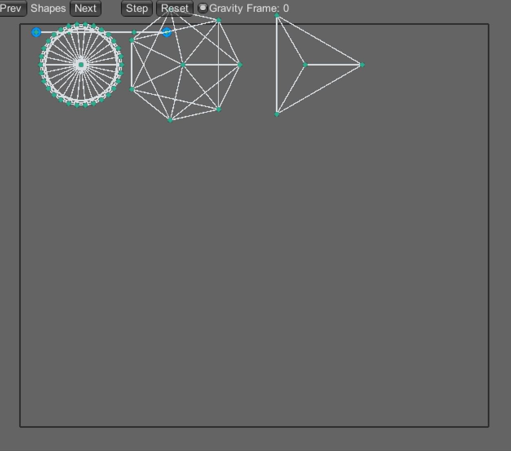

# 2D Physics Engine using Verlet

UniVer uses [Verlet Integration](https://en.wikipedia.org/wiki/Verlet_integration) to move soft-springy bodies on screen.

Some demo examples:

## Collision

## Pyramid falling

## Shapes

## Cloth

## Spiderweb

## Credits
UniVer is a mashup port of 2 Javascript Verlet engine:

- [VerletJs](https://github.com/subprotocol/verlet-js)
- [VerletEngine](https://codepen.io/ge1doot/pen/waunity_collisionzbjv)

